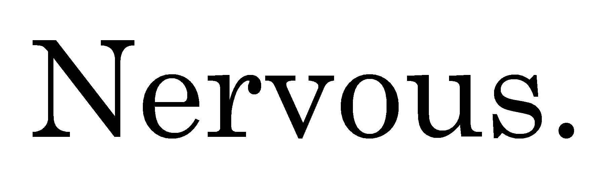

    

    <h1 align="center">The Nervous Toolkit</h1>

    
    
    

## Table of Contents

- [Table of Contents](#table-of-contents)
- [Introduction](#introduction)
- [Features](#features)
- [Use Cases](#use-cases)
- [Index of repositories](#index-of-repositories)
- [License](#license)
- [Acknowledgments](#acknowledgments)
- [Contact](#contact)

## Introduction

The Nervous Toolkit is an open-source and open-hardware ecosystem for physiological sensing and research.
This project aims at providing high-quality tools for advanced physiological monitoring across various domains.
The sensors developed in the project can especially be used in virtual environments, as they are designed to perform reliably even when the participant is moving.
This capability is enabled by seamlessly integrating the sensors into VR controllers through custom hardware add-ons.

## Features

- ❤️ **ECG Sensor**: Electrocardiography sensing from hands and forearms
- 💦 **EDA Sensor**: Advanced electrodermal activity measurement
- 🐍 **Python Backend**: Robust data management and real-time analysis

## Use Cases

The Nervous Toolkit is ideal for:

- 🔬 Scientific Research
- 🧠 Psychological Studies
- ❤️ Physiological Monitoring
- 🕶️ Virtual Reality Experiments

## Index of repositories

**Nervous-ECG**: A wearable electrocardiography sensing solution on hands and forearms

**Nervous-EDA**: A wearable electrodermal activity sensing solution powered by continuous impedance spectrscopy

**Nervous-Sensors**: A comprehensive Python package for:

- Multi-sensor connection management
- Real-time data plotting
- Lab Streaming Layer integration

---

## License

The entire Nervous initiative is licensed under the [MIT License](https://opensource.org/licenses/MIT). For more details, see the [License](LICENSE.md) file.

---

## Acknowledgments

This work was supported by the **French National Research Agency (ANR)** under grant **ANR-22-CE31-0023-03 RENFORCE**.

---

## Contact

[bertrand.massot@insa-lyon.fr](mailto:bertrand.massot@insa-lyon.fr)

---
